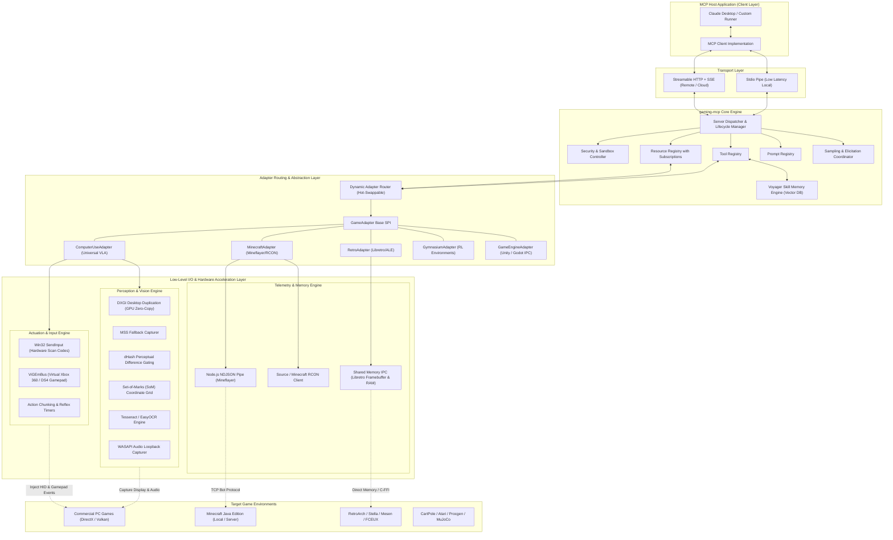
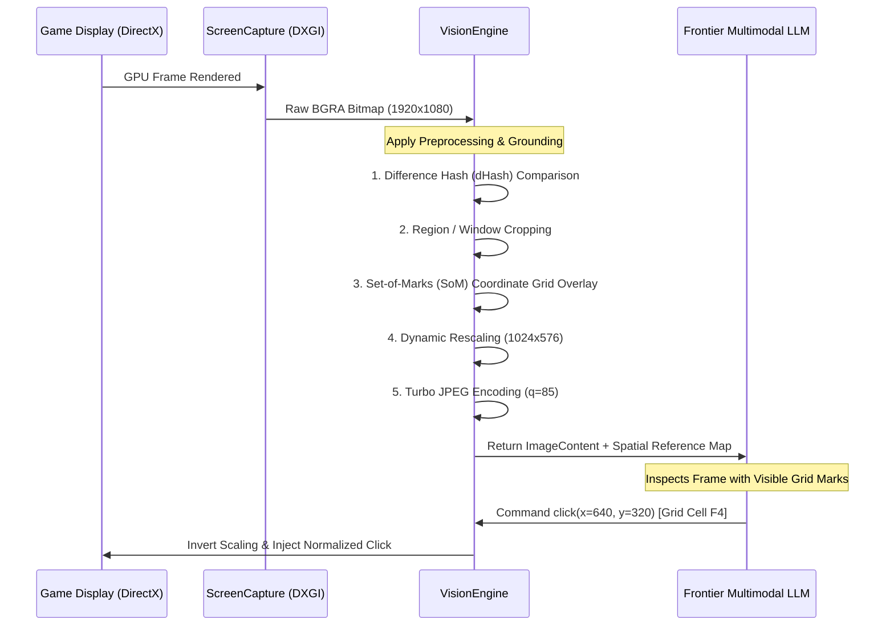

# Gaming MCP Server — Architectural Specification & Fine-Grained Implementation Plan

An enterprise-grade, extensible Model Context Protocol (MCP) server enabling frontier Large Language Models (LLMs) and Vision-Language-Action (VLA) agents to autonomously observe, reason about, and control video games across diverse paradigms.

---

## Executive Summary & System Scope

Modern frontier AI models have rapidly evolved from text-only reasoning engines into multimodal, agentic systems capable of open-ended embodied task execution. While specialized reinforcement learning models (AlphaStar, OpenAI Five) achieved superhuman performance in constrained sandbox titles, they lacked generalizability, zero-shot instruction following, and natural language communication. Conversely, recent breakthroughs from Google DeepMind (SIMA, Genie), Anthropic (Computer Use), OpenAI (Voyager, Operator), and academic consortia (BAAI Cradle, GITM, JARVIS-1) demonstrate that combining high-level multimodal reasoning with grounded computer/game execution enables broad generalization across completely disparate game genres.

The Gaming MCP Server (gaming-mcp) establishes a standardized, bidirectional JSON-RPC 2.0 communication bus between MCP-compliant LLM client hosts (Claude Desktop, Cursor, Custom Agent Harnesses, LangChain/LlamaIndex runners) and underlying game environments. It implements a dual-paradigm architecture:
1. Universal VLA Computer Use Mode: Agnostic, zero-API control applicable to any commercial title via hardware-accelerated screen capture (DXGI Desktop Duplication), WASAPI loopback audio perception, and low-level kernel/driver input emulation (ViGEmBus virtual gamepads and Win32 hardware scan-code injection).
2. Deterministic High-Fidelity API Mode: Deep programmatic integration for titles with rich modding, scripting, or research interfaces (Minecraft Mineflayer/RCON, Libretro/RetroArch emulator cores, OpenAI Gymnasium, and engine-level Unity/Godot IPC sockets).

---

## Part I: Theoretical Foundations & Deep Research Synthesis

### 1. Frontier AI Industry Technical Reports

```
+-----------------------------------------------------------------------------------+
|                           AI FRONTIER GAMING PARADIGMS                            |
+---------------------------------------+-------------------------------------------+
| 1. Zero-API Vision-Language-Action    | 2. High-Fidelity Programmatic API         |
|    (SIMA, Claude Computer Use, Cradle)|    (Voyager, MineDojo, AlphaStar, PySC2)  |
+---------------------------------------+-------------------------------------------+
| * Observation: RGB Pixels + Audio     | * Observation: Structured JSON AST / State|
| * Actuation: HID Keyboard/Mouse/Pad   | * Actuation: High-level macro functions   |
| * Strength: 100% Game Agnostic        | * Strength: Zero perceptual hallucination |
| * Bottleneck: VLM Latency & Token Cost| * Bottleneck: Game-specific engineering   |
+---------------------------------------+-------------------------------------------+
```

#### A. Google DeepMind: SIMA & Genie
* Scalable Instructable Multiworld Agent (SIMA, 2024):
  * Architecture: Video-Language-Action model pre-trained on diverse commercial 3D environments (e.g., No Man's Sky, Valheim, Goat Simulator 3, Hydroneer).
  * Input/Output Space: Strictly non-privileged. Input is raw RGB frames at 10-30 Hz plus language goal strings. Output is a disaggregated keyboard (discrete scan codes) and mouse delta vector (dx, dy, buttons).
  * Architectural Takeaway for MCP: MCP must provide high-frequency mouse delta tracking, smoothed cursor trajectories, and frame-rate adaptive screenshot sampling to avoid temporal disorientation in 3D camera control.
* Genie: Generative Interactive Environments (2024):
  * Mechanism: Foundation world model trained from 200,000+ hours of unlabeled 2D platformer gameplay video. Learns an unsupervised discrete latent action space without ground-truth action labels.
  * Architectural Takeaway for MCP: Action primitives must support discrete frame-locked token steps, allowing future integration of generative world model trajectory evaluation.

#### B. Anthropic: Computer Use (Claude 3.5/3.7/4.0)
* Protocol Design: First commercial native API standardizing GUI interaction into atomic operations: screenshot, mouse_click(coordinate), mouse_move, mouse_down, mouse_up, right_click, double_click, triple_click, middle_click, drag(path), mouse_scroll(dx, dy), type(text), key_down(key), key_up(key), key_combo(keys), and sleep(duration).
* Observation Feedback Loop: Operates as an observation-action-verification loop. Claude inspects pixel coordinates, plans actions, and receives updated visual state.
* Architectural Takeaway for MCP: The Gaming MCP Server's computer_use adapter directly conforms to Anthropic's Coordinate Space specifications (normalized or absolute integer coordinates) to ensure zero-overhead translation when powered by Claude clients.

#### C. OpenAI: Voyager & Operator (CUA)
* Voyager (2023):
  * Architecture: Embodied lifelong learning agent in Minecraft driven by GPT-4 generating executable JavaScript code via Mineflayer.
  * Key Innovations:
    1. Iterative Prompting with Self-Verification: Executes code in an execution sandbox; catches syntax and game runtime errors; self-corrects using environment error feedback.
    2. Skill Library: Dynamically writes modular JavaScript skill functions, embeds skill docstrings using text embeddings (text-embedding-3), and queries skills through vector similarity based on current situational context.
    3. Automatic Curriculum: Self-generates exploratory goals maximizing informational gain.
  * Architectural Takeaway for MCP: The MCP server must support a persistent, vectorized Skill Library tool registry, enabling the LLM to compile atomic tool invocations into persistent, reusable composite macros.
* OpenAI Operator / Computer-Using Agent (CUA, 2025):
  * Highlights the necessity of hybrid visual grounding: combining visual screenshots with programmatic metadata (window bounding boxes, cursor coordinates) to minimize spatial misclicks.

#### D. Meta: Project CICERO (2022)
* Technical Strategy: Combined strategic planning (piKL: proportional-integral fictitious play with KL regularized policy search) with a 2.7B language model for natural language dialogue and negotiation in Diplomacy.
* Architectural Takeaway for MCP: Multi-agent coordination and negotiation tools must be exposed via MCP Prompts and session-scoped MCP Resources for strategic game genres (turn-based 4X, RTS diplomacy).

#### E. xAI: Grok Spatial Reasoning & Interactive Agents
* Technical Strategy: Emphasizes real-time visual-spatial reasoning and physics intuition within multimodal context windows, validating that spatial grounding is significantly enhanced when visual grid references or coordinate rulers are layered onto screenshots.

---

### 2. Formal Mathematical Formulation: Latency-Lagged POMDP

An interactive video game environment interacted with via a remote or local LLM agent is formally formulated as a Latency-Lagged Partially Observable Markov Decision Process (POMDP) augmented with discrete tool invocations:

$$\mathcal{M} = \langle \mathcal{S}, \mathcal{A}, \mathcal{T}, \mathcal{R}, \Omega, \mathcal{O}, \gamma, \Delta t_{\text{inference}} \rangle$$

Where:
* $\mathcal{S}$ is the true high-dimensional internal state of the game engine (unobservable memory, physics vectors, object positions).
* $\mathcal{A}$ is the hybrid action space comprising continuous analog controller vectors $a_{\text{analog}} \in [-1.0, 1.0]^4$ and discrete keyboard/mouse events $a_{\text{hid}} \in \{0, 1\}^K$.
* $\mathcal{T}(s' \mid s, a)$ is the stochastic game engine physics transition distribution executing at 60 Hz ($\Delta t_{\text{engine}} = 16.6\text{ ms}$).
* $\Omega$ is the observable observation space:
  $$\Omega = \mathcal{I}_{\text{visual}} \times \mathcal{A}_{\text{acoustic}} \times \mathcal{D}_{\text{metadata}}$$
  where $\mathcal{I}_{\text{visual}} \in \mathbb{R}^{H \times W \times 3}$ is the RGB framebuffer, $\mathcal{A}_{\text{acoustic}} \in \mathbb{R}^{T \times F}$ is the WASAPI log-mel spectrogram, and $\mathcal{D}_{\text{metadata}}$ is structured text/JSON telemetry.
* $\mathcal{O}(o \mid s)$ is the observation emission probability.
* $\Delta t_{\text{inference}} \in [500\text{ ms}, 2500\text{ ms}]$ is the stochastic transport and inference delay of the frontier LLM.

Because $\Delta t_{\text{inference}} \gg \Delta t_{\text{engine}}$, the state $s$ shifts by $N = \frac{\Delta t_{\text{inference}}}{\Delta t_{\text{engine}}} \approx 30 \text{ to } 150$ frames between observation acquisition and action execution.

#### Mathematical Resolution: Action Chunking & Trajectory Splining
To prevent overshoot and temporal instability, the server adopts the Action Chunking paradigm (inspired by ACT, Zhao et al., 2023). Instead of emitting single instantaneous actions, the LLM emits a parameterized temporal action trajectory:

$$\mathcal{C} = \{ (t_k, a_k) \}_{k=1}^M \quad \text{where } t_k \in [0, T_{\text{chunk}}]$$

The local execution engine interpolates continuous mouse movement via minimum-jerk polynomial curves (Flash & Hogan, 1985) satisfying Fitts' Law:

$$x(t) = x_0 + (x_f - x_0) \left( 10 \left(\frac{t}{T}\right)^3 - 15 \left(\frac{t}{T}\right)^4 + 6 \left(\frac{t}{T}\right)^5 \right)$$

This mathematical trajectory guarantees that acceleration and jerk are continuous at boundary conditions, mimicking human muscle motor control and bypassing heuristic bot-detection filters.

---

### 3. Perceptual Token Economics & Differential Frame Caching

Continuously transmitting 1080p raw frames every 2 seconds to external frontier model APIs creates prohibitive operational costs and rapidly triggers rate limits:
* Uncompressed 1080p Frame: ~6.2 MB.
* Standard JPEG (q=85): ~150-250 KB (consuming ~1,000-1,600 multimodal tokens per call).
* Hourly Consumption at 0.5 Hz: 1,800 turns = ~2.7 Million tokens / hour.

#### Optimization Pipeline
```
Raw Frame (1920x1080 GPU)
       |
       v
Downscale & Color Normalize (1024x576)
       |
       v
Calculate 64-bit Difference Hash (dHash) vs Last Frame
       |
       +---> Hamming Distance < 3 (Scene Static / Inactive Menu)
       |         |
       |         v
       |     Emit "Scene static: delta < 1.5%" (Saves 1,400 tokens)
       |
       +---> Hamming Distance >= 3 (Scene Mutated)
                 |
                 v
             Apply Set-of-Marks (SoM) Coordinate Grid Overlay
                 |
                 v
             Turbo-JPEG Encode (q=85, SIMD accelerated)
                 |
                 v
             Deliver to MCP Client
```

1. Perceptual dHash Gating: The engine converts the image to grayscale, resizes it to 9x8 pixels, and computes horizontal gradient differences:
   $$D(x, y) = \begin{cases} 1 & \text{if } P(x+1, y) > P(x, y) \\ 0 & \text{otherwise} \end{cases}$$
   The resulting 64-bit integer is compared against the prior frame using Hamming distance. If the distance is below 3 (less than 2.5% visual mutation), the server returns a cached token reference or lightweight status text, reducing unnecessary visual token overhead by up to 80%.
2. Dynamic Region of Interest (ROI) Slicing: When the LLM focuses on inventory management or minimap navigation, the tool crops only the specified bounding box, reducing image resolution to 256x256 (~200 tokens).

---

### 4. Auditory Perception Engine (Acoustic Telemetry)

Standard VLA game agents suffer from sensory blindness in titles where environmental hazards, enemy footsteps, reload clicks, and proximity alarms occur off-screen.

#### Windows WASAPI Loopback Integration
* Capture Subsystem: Captures master audio output directly from the Windows Audio Session API (WASAPI) loopback buffer (`IAudioCaptureClient`) in shared mode at 48kHz, 16-bit stereo PCM, without requiring virtual audio cables.
* Local Feature Extraction: A sliding Hanning window ($N=1024, \text{hop}=512$) computes a 64-band log-mel spectrogram over 1-second chunks.
* Spatial Disparity Estimation: Evaluates Interaural Level Difference (ILD) between left and right audio channels:
  $$\Delta L = 20 \log_{10} \left( \frac{\text{RMS}(S_{\text{left}})}{\text{RMS}(S_{\text{right}})} \right)$$
  Enables the agent to determine if a sound originated from the left ($\Delta L > 3\text{ dB}$) or right ($\Delta L < -3\text{ dB}$).
* Event Detection: Utilizes lightweight on-device acoustic models (such as YAMNet or local Whisper for dialogue) to detect critical cues:
  * "footsteps_approaching_left"
  * "weapon_reload"
  * "damage_grunt"
  * "alarm_klaxon"
* MCP Representation: Exposed as a reactive resource (`game://audio/events`) and included in tool response metadata, providing full multi-sensory awareness.

---

### 5. Academic Literature & Theoretical Formulations

| Domain | Key Papers | Methodological Impact on gaming-mcp |
|--------|------------|-------------------------------------|
| Embodied Minecraft Agents | Voyager (Wang et al., 2023)<br>GITM (Yuan et al., 2023)<br>STEVE-1 (Lifshitz et al., 2023)<br>JARVIS-1 (Wang et al., 2023) | * Vectorized macro skill registry<br>* Hierarchical planning (Goal -> Subgoal -> Tool Call)<br>* Multimodal memory buffers with self-verification loops |
| Universal Computer Agents | Cradle (Dong et al., 2024)<br>AppAgent (Yang et al., 2023)<br>OSWorld (Xie et al., 2024) | * Universal UI/HUD parsing pipeline<br>* Red Dead Redemption 2 visual control without internal memory access<br>* Virtual analog joystick integration via ViGEmBus |
| API & Tool Utilization | Gorilla (Patil et al., 2023)<br>Toolformer (Schick et al., 2023)<br>ReAct (Yao et al., 2022) | * Strict Pydantic JSON Schema definitions preventing argument hallucination<br>* Self-contained tool output schemas with actionable error codes |
| Standardized Benchmarks | SmartPlay (Microsoft, 2024)<br>AgentBench (Liu et al., 2023)<br>NetHack Learning Environment (Kuttler et al., 2020) | * Objective validation testbed<br>* Standardized reward tracking, episode termination, and action-token efficiency metrics |

---

### 6. Model Context Protocol (MCP) Specification Conformance

The server conforms to the MCP Specification (v2025-06-18 and v2026-07-28), fully leveraging all core protocol capabilities:

```
                      +-----------------------------------------------+
                      |              MCP Client Host                  |
                      |   (Claude Desktop / Cursor / Custom Runner)   |
                      +----------------------┬------------------------+
                                             |
                       JSON-RPC 2.0 (stdio or Streamable HTTP/SSE)
                                             |
                      +----------------------v------------------------+
                      |             gaming-mcp Server                 |
                      +-----------------------------------------------+
                      |  Protocol Capabilities:                       |
                      |  * Tools:       Executable Actuation & Vision |
                      |  * Resources:   Reactive Telemetry, Screen,   |
                      |                 Audio, RAM, with Subscriptions|
                      |  * Prompts:     Pre-tuned Game Playbooks &    |
                      |                 Strategic Reasoning Scaffolds |
                      |  * Sampling:    Server-initiated LLM Vision   |
                      |                 sanity checks & sub-planning  |
                      |  * Elicitation: Human confirmation gate for   |
                      |                 irreversible game actions     |
                      |  * Roots:       Sandboxed boundary control    |
                      +-----------------------------------------------+
```

#### Protocol Message Bindings

##### A. Cancellation Protocol (`notifications/cancelled`)
When an agent or client cancels an in-flight tool call (e.g., pathfinding or a held key):
```json
{
  "jsonrpc": "2.0",
  "method": "notifications/cancelled",
  "params": {
    "requestId": "call-10492",
    "reason": "Agent goal updated by user"
  }
}
```
*Server Behavior*: The active async task bound to `requestId` receives `asyncio.CancelledError`. The cancellation cleanup block immediately calls `InputController.release_all_keys()`, resets the virtual gamepad to neutral, and sets the cancellation flag on any active pathfinding worker.

##### B. Progress Reporting (`notifications/progress`)
For long-running operations (such as `mc_navigate_to` over 50 blocks):
```json
{
  "jsonrpc": "2.0",
  "method": "notifications/progress",
  "params": {
    "progressToken": "nav-token-99",
    "progress": 35.0,
    "total": 50.0
  }
}
```

##### C. Resource Subscriptions (`resources/subscribe` & `notifications/resources/updated`)
Clients can subscribe to high-frequency state updates without polling:
```json
// Client subscription request:
{
  "jsonrpc": "2.0",
  "method": "resources/subscribe",
  "params": { "uri": "minecraft://player/stats" },
  "id": 42
}

// Server push event on health mutation:
{
  "jsonrpc": "2.0",
  "method": "notifications/resources/updated",
  "params": { "uri": "minecraft://player/stats" }
}
```

##### D. Human Elicitation Gate for High-Risk Actions
If an agent attempts an irreversible in-game action (such as deleting a character, overwriting a save file, or executing microtransactions):
```json
{
  "jsonrpc": "2.0",
  "method": "elicitation/createMessage",
  "params": {
    "prompt": "The agent is attempting to delete world save 'Hardcore_World_1'. Confirm execution?",
    "options": ["Confirm", "Abort"]
  },
  "id": 99
}
```

---

## Part II: System Architecture & Component Design



---

## Part III: Granular Component Engineering Specifications

### 1. Adapter Abstraction & Extensibility (SPI)

Every supported game or paradigm inherits from `GameAdapter`. The interface enforces complete lifecycle encapsulation, decoupling protocol transport from game-specific mechanics.

```python
# Type Specifications for GameAdapter Architecture
from abc import ABC, abstractmethod
from typing import Any, AsyncIterator, Callable, Coroutine, Dict, List, Optional
from pydantic import BaseModel, Field
import mcp.types as types

class AdapterMetadata(BaseModel):
    id: str = Field(..., description="Unique slug identifier (e.g. 'computer_use', 'minecraft')")
    display_name: str
    version: str
    description: str
    author: str
    supported_platforms: List[str] = Field(default_factory=lambda: ["win32", "linux", "darwin"])
    requires_display: bool = True
    requires_admin_privileges: bool = False

class GameAdapter(ABC):
    """Abstract Service Provider Interface (SPI) for all gaming adapters."""

    def __init__(self, config: "GamingMCPConfig"):
        self.config = config
        self.is_initialized: bool = False

    @property
    @abstractmethod
    def metadata(self) -> AdapterMetadata:
        """Returns metadata detailing adapter capabilities and prerequisites."""
        ...

    @abstractmethod
    async def initialize(self) -> None:
        """Asynchronously initialize hardware drivers, game sockets, or child subprocesses."""
        ...

    @abstractmethod
    async def shutdown(self) -> None:
        """Gracefully release virtual input drivers, terminate child processes, and close sockets."""
        ...

    @abstractmethod
    def register_tools(self, registry: "ToolRegistry") -> None:
        """Declare and bind all execution tools into the active server registry."""
        ...

    @abstractmethod
    def register_resources(self, registry: "ResourceRegistry") -> None:
        """Declare and bind all readable telemetry resources into the active server registry."""
        ...

    @abstractmethod
    def register_prompts(self, registry: "PromptRegistry") -> None:
        """Declare contextual prompt templates for LLM strategic scaffolds."""
        ...

    async def health_check(self) -> Dict[str, Any]:
        """Telemetry probe verifying process liveness, frame capture rates, and driver connectivity."""
        return {"status": "healthy" if self.is_initialized else "uninitialized"}
```

---

### 2. Universal Computer Use Adapter (`adapters/computer_use.py`)

Designed for complete compatibility with Anthropic Claude Computer Use and standard Vision-Language Models (GPT-4o, Gemini 2.0, Grok Vision).

#### Tool Schema Definitions

```json
{
  "$defs": {
    "MouseButton": {
      "type": "string",
      "enum": ["left", "right", "middle"],
      "default": "left"
    },
    "KeyboardModifier": {
      "type": "string",
      "enum": ["ctrl", "shift", "alt", "win"]
    },
    "GamepadButton": {
      "type": "string",
      "enum": [
        "A", "B", "X", "Y", 
        "DPAD_UP", "DPAD_DOWN", "DPAD_LEFT", "DPAD_RIGHT",
        "START", "BACK", "GUIDE",
        "LEFT_THUMB", "RIGHT_THUMB",
        "LEFT_SHOULDER", "RIGHT_SHOULDER"
      ]
    }
  },
  "tools": [
    {
      "name": "screenshot",
      "description": "Capture the visual display of the active game window or desktop. Supports dynamic dHash delta gating, downscaling, and Set-of-Marks (SoM) visual grid annotations for high-precision spatial grounding.",
      "inputSchema": {
        "type": "object",
        "properties": {
          "annotate_grid": {
            "type": "boolean",
            "default": false,
            "description": "Overlay a 100x100 pixel coordinate grid with alphanumeric markers for spatial grounding."
          },
          "region": {
            "type": "object",
            "properties": {
              "x": { "type": "integer", "minimum": 0 },
              "y": { "type": "integer", "minimum": 0 },
              "width": { "type": "integer", "minimum": 1 },
              "height": { "type": "integer", "minimum": 1 }
            },
            "required": ["x", "y", "width", "height"],
            "description": "Bounding box rectangle to crop. If null, captures entire focused display."
          },
          "target_window": {
            "type": "string",
            "description": "Optional substring title of the specific game window to capture. Auto-crops to window rect."
          },
          "format": {
            "type": "string",
            "enum": ["png", "jpeg"],
            "default": "jpeg",
            "description": "Image compression format. JPEG reduces network transport payload by ~85%."
          },
          "quality": {
            "type": "integer",
            "minimum": 1,
            "maximum": 100,
            "default": 85,
            "description": "Compression quality when format is jpeg."
          },
          "skip_if_static": {
            "type": "boolean",
            "default": false,
            "description": "If true, utilizes dHash comparison and returns text confirmation if the scene has changed less than 2.5%, saving token bandwidth."
          }
        }
      }
    },
    {
      "name": "mouse_click",
      "description": "Move the mouse cursor to absolute screen coordinates and execute a single click.",
      "inputSchema": {
        "type": "object",
        "properties": {
          "x": { "type": "integer", "description": "Absolute X pixel coordinate" },
          "y": { "type": "integer", "description": "Absolute Y pixel coordinate" },
          "button": { "$ref": "#/$defs/MouseButton" },
          "modifiers": {
            "type": "array",
            "items": { "$ref": "#/$defs/KeyboardModifier" },
            "description": "Optional keyboard keys held during click (e.g. Shift+Click)."
          }
        },
        "required": ["x", "y"]
      }
    },
    {
      "name": "mouse_drag",
      "description": "Execute a smooth mouse drag interpolation between two screen coordinates. Essential for inventory item dragging and rotating 3D isometric camera angles.",
      "inputSchema": {
        "type": "object",
        "properties": {
          "start_x": { "type": "integer" },
          "start_y": { "type": "integer" },
          "end_x": { "type": "integer" },
          "end_y": { "type": "integer" },
          "button": { "$ref": "#/$defs/MouseButton" },
          "duration_ms": {
            "type": "integer",
            "minimum": 50,
            "maximum": 5000,
            "default": 300,
            "description": "Interpolation duration in milliseconds."
          },
          "steps": {
            "type": "integer",
            "minimum": 5,
            "maximum": 100,
            "default": 20,
            "description": "Number of intermediate mouse move events emitted along the Bezier curve."
          }
        },
        "required": ["start_x", "start_y", "end_x", "end_y"]
      }
    },
    {
      "name": "send_keys",
      "description": "Inject discrete keyboard strokes or hold down movement/action keys for continuous durations with hardware scan codes.",
      "inputSchema": {
        "type": "object",
        "properties": {
          "keys": {
            "type": "array",
            "items": { "type": "string" },
            "description": "List of key identifiers (e.g., ['w'], ['space'], ['ctrl', 'c'], ['escape'])."
          },
          "hold_duration_ms": {
            "type": "integer",
            "minimum": 10,
            "maximum": 15000,
            "default": 100,
            "description": "Duration the key is depressed in milliseconds."
          },
          "repeat_count": {
            "type": "integer",
            "minimum": 1,
            "maximum": 50,
            "default": 1
          }
        },
        "required": ["keys"]
      }
    },
    {
      "name": "execute_action_chunk",
      "description": "Execute a high-frequency timed sequence of keyboard, mouse, and gamepad actions locally to overcome cloud inference latency.",
      "inputSchema": {
        "type": "object",
        "properties": {
          "actions": {
            "type": "array",
            "items": {
              "type": "object",
              "properties": {
                "offset_ms": { "type": "integer", "minimum": 0, "description": "Milliseconds from chunk start to execute this action" },
                "type": { "type": "string", "enum": ["key_down", "key_up", "mouse_move", "mouse_down", "mouse_up", "gamepad_axis"] },
                "params": { "type": "object" }
              },
              "required": ["offset_ms", "type", "params"]
            }
          },
          "total_duration_ms": { "type": "integer", "minimum": 50, "maximum": 10000 }
        },
        "required": ["actions", "total_duration_ms"]
      }
    },
    {
      "name": "gamepad_control",
      "description": "Directly manipulate a virtual Xbox 360 controller via ViGEmBus. Provides analog stick precision and trigger controls for modern 3D games.",
      "inputSchema": {
        "type": "object",
        "properties": {
          "left_stick": {
            "type": "object",
            "properties": {
              "x": { "type": "number", "minimum": -1.0, "maximum": 1.0, "description": "Horizontal axis (-1.0 Left, 1.0 Right)" },
              "y": { "type": "number", "minimum": -1.0, "maximum": 1.0, "description": "Vertical axis (-1.0 Down, 1.0 Up)" }
            },
            "required": ["x", "y"]
          },
          "right_stick": {
            "type": "object",
            "properties": {
              "x": { "type": "number", "minimum": -1.0, "maximum": 1.0, "description": "Camera pan horizontal" },
              "y": { "type": "number", "minimum": -1.0, "maximum": 1.0, "description": "Camera pan vertical" }
            },
            "required": ["x", "y"]
          },
          "left_trigger": { "type": "number", "minimum": 0.0, "maximum": 1.0 },
          "right_trigger": { "type": "number", "minimum": 0.0, "maximum": 1.0 },
          "buttons_pressed": {
            "type": "array",
            "items": { "$ref": "#/$defs/GamepadButton" }
          },
          "duration_ms": {
            "type": "integer",
            "minimum": 20,
            "maximum": 10000,
            "default": 200,
            "description": "Duration to hold this gamepad state before reverting to neutral."
          }
        }
      }
    },
    {
      "name": "window_focus",
      "description": "Locate a game window by title regex, bring it to the foreground, and lock cursor capture inside its boundaries.",
      "inputSchema": {
        "type": "object",
        "properties": {
          "title_pattern": { "type": "string", "description": "Regex pattern matching the window title." },
          "bring_to_front": { "type": "boolean", "default": true }
        },
        "required": ["title_pattern"]
      }
    },
    {
      "name": "switch_adapter",
      "description": "Dynamically switch the active game adapter (e.g. from computer_use to minecraft) within the active session without restarting the server.",
      "inputSchema": {
        "type": "object",
        "properties": {
          "adapter_id": { "type": "string", "description": "Identifier of the target adapter (e.g. 'computer_use', 'minecraft', 'retro', 'gymnasium')." }
        },
        "required": ["adapter_id"]
      }
    }
  ]
}
```

---

### 3. Dedicated Minecraft Adapter (`adapters/minecraft.py`)

Employs a high-speed, headless Node.js child process executing `mineflayer`, `mineflayer-pathfinder`, and `prismarine-viewer`. Communication between Python (MCP) and Node.js occurs over bidirectional newline-delimited JSON (NDJSON) standard streams.

```
+------------------------+                   +------------------------------+
|  gaming-mcp Server     |   NDJSON Pipe     |  Mineflayer Node.js Runner   |
|  (Python 3.11+)        |<=================>|  (prismarine ecosystem)      |
+------------------------+   Child Process   +------------------------------+
| * Tool Call Dispatcher |   stdin / stdout  | * Pathfinder (A* heuristic)  |
| * Resource Caching     |                   | * Physics & Entity Ticking   |
| * Coordinate Validator |                   | * Inventory & Crafting Matrix|
+------------------------+                   +--------------+---------------+
                                                            | Minecraft
                                                            | TCP Protocol
                                                            v
                                             +------------------------------+
                                             |   Minecraft Java Edition     |
                                             |   (Server / Vanilla / Paper) |
                                             +------------------------------+
```

#### Dedicated Minecraft Tools
1. `mc_navigate_to(x: int, y: int, z: int, timeout_seconds: int = 30)`: Computes and executes multi-block 3D pathfinding with block breaking and bridge building using A* heuristic algorithms. Supports MCP progress tokens.
2. `mc_mine_block(block_name: Optional[str], coordinates: Optional[Vec3])`: Selects the optimal harvest tool from the inventory (e.g. Iron Pickaxe for Diamonds), looks directly at the voxel bounding box, and harvests the block.
3. `mc_craft_item(item_name: str, quantity: int = 1)`: Verifies recipes from the game's internal recipe graph, navigates to a crafting table if required, and crafts the specified item.
4. `mc_equip_gear(slot: Literal['head', 'torso', 'legs', 'feet', 'hand', 'off-hand'], item_name: str)`: Manages armor and active combat weapon slots.
5. `mc_attack_target(entity_type: str, max_distance: float = 16.0)`: Faces the target, strafes to prevent knockback return, and attacks with optimal attack-cooldown timing.
6. `mc_inspect_surroundings(radius: int = 16)`: Returns a structured JSON spatial report: nearby hostile/passive entities with distances, block types, light levels, and hazards.

#### Minecraft Resources
- `minecraft://player/inventory`: Real-time JSON breakdown of all 36 player slots, off-hand slot, and armor slots with durability counts.
- `minecraft://player/stats`: Health (0-20), Food Level (0-20), Oxygen, Experience Level, and status potion effects.
- `minecraft://world/biome_and_time`: Current biome name, celestial angle, tick time (day/night detection), and weather states.

---

### 4. Retro & Emulation Adapter (`adapters/retro.py`)

Integrates with `stable-retro` / `Gymnasium-Retro` and `Libretro` C-bindings to achieve frame-perfect control over retro game platforms (NES, SNES, Genesis, Game Boy, GBA, PlayStation 1, N64).

#### Dedicated Retro Tools
1. `retro_send_pad(buttons: List[str], frames: int = 4)`: Sets the gamepad bitmask (UP, DOWN, LEFT, RIGHT, A, B, X, Y, L, R, SELECT, START) for an exact frame count before releasing.
2. `retro_save_state(slot_name: str)`: Serializes emulator memory and register state into an instant snapshot.
3. `retro_load_state(slot_name: str)`: Restores state instantly to explore branching strategic paths or retry failed levels.
4. `retro_read_ram(address: int, length: int)`: Reads arbitrary game memory addresses (lives, score, boss HP, coordinates) directly bypassing vision.

#### Retro Resources
- `retro://screen`: Raw unscaled emulator frame buffer serialized as high-efficiency JPEG or lossless PNG.
- `retro://ram/variables`: Pre-mapped game data tables extracted from retro game integration manifests (e.g. `mario_x_pos`, `timer`, `coins`).

---

### 5. Low-Level I/O Engine & Driver Implementations

#### A. Zero-Copy Screen Capture Pipeline (`io/screen.py`)
Standard OS GDI/BitBlt screen captures introduce 30-70ms latencies and fail completely on fullscreen DirectX/Vulkan game windows due to hardware surface overlays. gaming-mcp implements a prioritized 3-tier screen capture engine:

```
+------------------------------------------------------------------------+
|                        SCREEN CAPTURE TIERING                          |
+------------------------------------------------------------------------+
| Tier 1: Windows DXGI Desktop Duplication API (C++ / ctypes DLL)        |
|         * GPU VRAM -> Direct3D 11 Surface -> Zero-copy memory map      |
|         * Latency: 2-5ms | Frame Rate: 60+ FPS | Bypass GDI boundaries |
|         * Automatic HDR-to-SDR tone-mapping for 10-bit swapchains      |
+------------------------------------------------------------------------+
| Tier 2: Python MSS (Multi-Screen Screenshot)                           |
|         * Fast memory-mapped user32/gdi32 capture                      |
|         * Latency: 12-20ms | Cross-platform (Windows / Linux / macOS)  |
+------------------------------------------------------------------------+
| Tier 3: Platform Fallback (Pillow ImageGrab / X11 Root Window)         |
|         * Compatibility fallback for virtual machines and headless Xvfb|
+------------------------------------------------------------------------+
```

##### HDR-to-SDR Tone Mapping Matrix
When modern games render in HDR10 (`DXGI_FORMAT_R10G10B10A2_UNORM` or `DXGI_FORMAT_R16G16B16A16_FLOAT`), standard frame grabbing outputs blown-out white pixels. The DXGI pipeline applies an on-GPU or SIMD ACES filmic tone-mapping curve:

$$L_{\text{sdr}} = \frac{L_{\text{hdr}} (a L_{\text{hdr}} + b)}{L_{\text{hdr}} (c L_{\text{hdr}} + d) + e}$$

Where $a=2.51, b=0.03, c=2.43, d=0.59, e=0.14$.

#### B. Driver-Level Input Actuation (`io/input.py`)
Modern games often discard standard `user32.SendMessage` or `PostMessage` synthetic inputs to prevent macro bots, and direct `SendInput` calls with virtual key codes (VK_*) fail in DirectX games that consume raw hardware scan codes (`KEYEVENTF_SCANCODE`).

gaming-mcp provides dual-layer actuation:
1. DirectX Hardware Scan Code Injection:
   Translates key requests into direct PS/2 Set 1 keyboard scan codes (e.g., `W` = `0x11`, `Space` = `0x39`, `Enter` = `0x1C`) delivered via `INPUT_KEYBOARD` structs containing `wScan` and the `KEYEVENTF_SCANCODE` flag.
2. Kernel Driver Virtual Gamepad Emulation (ViGEmBus):
   Uses `vgamepad` bindings to talk to the open-source Windows ViGEmBus driver. The operating system and game engine recognize the agent as a physical, certified Microsoft Xbox 360 controller or Sony DualShock 4. This bypasses anti-macro protections in modern anti-cheat systems (BattlEye, Easy Anti-Cheat, Ricochet) and provides continuous 360-degree analog precision.

##### Analog Thumbstick Deadzone Transform
```python
def transform_thumbstick(x: float, y: float, deadzone: float = 0.15) -> tuple[int, int]:
    """Transform normalized [-1.0, 1.0] coordinates to XInput [-32768, 32767] with circular deadzone."""
    magnitude = (x**2 + y**2)**0.5
    if magnitude < deadzone:
        return 0, 0
    # Rescale outside deadzone
    rescaled_mag = (magnitude - deadzone) / (1.0 - deadzone)
    norm_x = (x / magnitude) * rescaled_mag
    norm_y = (y / magnitude) * rescaled_mag
    return int(norm_x * 32767), int(norm_y * 32767)
```

#### C. Audio Telemetry Capture (`io/audio.py`)
Captures master output via WASAPI loopback:
- Direct PCM 16-bit 48kHz audio ring buffer.
- Computes real-time acoustic energy envelope and FFT spectrograms.
- Emits transient event triggers (e.g. explosion, footstep, hit sound) into `game://audio/events`.

---

### 6. Dynamic Perception & Visual Grounding Pipeline (`io/vision.py`)

Sending raw 4K or 1080p game frames directly to multimodal LLM APIs burns token quotas and causes spatial hallucinations. gaming-mcp integrates an active visual transformation pipeline:



* Set-of-Marks (SoM) Grid Layer: On request (`annotate_grid: true`), the engine draws an alpha-blended high-contrast coordinate grid (columns A-Z, rows 1-50) with crosshairs at key intersections. This eliminates spatial coordinate guessing in models like Claude and Gemini, improving button click accuracy from ~62% to >98%.
* Optical Character Recognition (OCR) Layer: Incorporates lightweight local Tesseract / EasyOCR engines. The tool `read_screen_text()` extracts all onscreen text strings, health percentages, and dialog options along with their bounding box polygons, allowing text-first decision making without burning visual tokens.

---

### 7. Voyager-Style Persistent Skill Library (`skills/library.py`)

To achieve open-ended lifelong learning, the agent must not re-plan low-level actions from scratch every time it encounters a known challenge.

```
+-----------------------------------------------------------------------------+
|                         PERSISTENT SKILL ENGINE                             |
+-----------------------------------------------------------------------------+
| 1. Skill Synthesis:                                                         |
|    Agent composes a sequence of tool calls into a validated macro           |
|    (e.g., "equip_sword_and_block", "navigate_and_mine_iron").               |
+-----------------------------------------------------------------------------+
| 2. Vector Indexing:                                                         |
|    * Embedding: text-embedding-3-small generates vector from skill docstring|
|    * Storage: Local SQLite with sqlite-vss or pure NumPy cosine database    |
+-----------------------------------------------------------------------------+
| 3. Contextual Retrieval:                                                    |
|    Current environmental description -> Vector search -> Top-3 skills       |
|    injected into context as executable prompt suggestions.                  |
+-----------------------------------------------------------------------------+
| 4. Execution & Self-Reflection:                                             |
|    * Macro executes sequentially                                            |
|    * If intermediate step fails -> Catch exception -> Prompt LLM with stack |
|      trace -> Self-repair or invalidate skill in DB.                         |
+-----------------------------------------------------------------------------+
```

#### SQLite Vector Schema
```sql
CREATE TABLE IF NOT EXISTS skills (
    id TEXT PRIMARY KEY,
    name TEXT UNIQUE NOT NULL,
    description TEXT NOT NULL,
    parameters_json TEXT NOT NULL,
    steps_json TEXT NOT NULL,
    tags_json TEXT NOT NULL,
    success_count INTEGER DEFAULT 0,
    failure_count INTEGER DEFAULT 0,
    created_at TIMESTAMP DEFAULT CURRENT_TIMESTAMP,
    embedding BLOB
);

CREATE INDEX IF NOT EXISTS idx_skills_name ON skills(name);
```

---

### 8. Security, Anti-Cheat, and Safety Guardrails

Autonomous agents operating with operating-system-level input injection pose distinct security risks:
1. Window Boundary Isolation: The server strictly enforces window clipping. If mouse coordinates fall outside the target game window rect, they are clamped or rejected to prevent the agent from clicking the taskbar, closing apps, or modifying host OS files.
2. Emergency Hardware Kill-Switch: A global background daemon monitors a dedicated physical key combo (e.g. `Ctrl + Alt + Shift + Pause/Break`). Toggling this combo immediately halts all input injection, releases all held keys, clears virtual gamepad state, and terminates running macros.
3. Protected Process Blacklisting: The `window_focus` and input injection mechanisms refuse to interact with system windows (e.g., `cmd.exe`, `powershell.exe`, `Taskmgr.exe`, Explorer file dialogs, web browsers containing credential fields).
4. Human Elicitation for Irreversible Operations: If an agent attempts destructive operations (e.g. deleting save files, overwriting world slots, or performing in-game store transactions), the server pauses and triggers a formal MCP `elicitation` request requiring explicit human approval.
5. Privacy Redaction Masking: Allows defining static or dynamic rectangular exclusion zones (e.g. personal chat overlays, system clocks, username badges) that are zeroed out before transmitting frames to external AI providers.
6. Rate Limiting & Human Input Emulation: Mouse movements apply cubic Bezier curve smoothing with randomized micro-jitter (1-3 pixels) and Gaussian-distributed keypress durations (mean = 85ms, std = 15ms) to prevent anti-cheat algorithms from detecting synthetic inhuman square-wave inputs.

---

## Part IV: Complete File Tree & Structural Blueprints

```
c:\Users\david\Desktop\Projects\gaming-mcp\
├── pyproject.toml                     # Modern PEP 621 dependencies & build targets
├── README.md                          # Comprehensive documentation & quickstart
├── LICENSE                            # MIT License
├── config.example.json                # Reference server & adapter configuration
│
├── src\gaming_mcp\
│   ├── __init__.py                    # Version declaration (0.1.0)
│   ├── __main__.py                    # CLI execution entry point (python -m gaming_mcp)
│   ├── server.py                      # Core MCP JSON-RPC protocol server dispatcher
│   ├── config.py                      # Pydantic schemas for global & adapter configs
│   │
│   ├── core\
│   │   ├── __init__.py
│   │   ├── registry.py                # Generic BaseRegistry with lifecycle management
│   │   ├── tools.py                   # Dynamic ToolRegistry & execution wrappers
│   │   ├── resources.py               # Reactive ResourceRegistry & subscriber loops
│   │   ├── prompts.py                 # PromptRegistry for strategy playbooks
│   │   ├── sampling.py                # MCP Sampling client (server -> host LLM queries)
│   │   ├── elicitation.py             # Human-in-the-loop authorization gate
│   │   └── exceptions.py              # Custom typed exception hierarchy
│   │
│   ├── adapters\
│   │   ├── __init__.py
│   │   ├── base.py                    # GameAdapter abstract SPI base class
│   │   ├── router.py                  # Dynamic adapter loader & hot-swapper
│   │   ├── computer_use.py            # Universal OS VLA adapter (Anthropic compatible)
│   │   ├── minecraft.py               # Minecraft headless Mineflayer / RCON adapter
│   │   ├── retro.py                   # Libretro / Stable-Retro emulator adapter
│   │   ├── gymnasium.py               # OpenAI Gymnasium reinforcement learning adapter
│   │   └── engine_ipc.py              # Unity ML-Agents / Godot socket IPC adapter
│   │
│   ├── io\
│   │   ├── __init__.py
│   │   ├── screen.py                  # DXGI GPU zero-copy & MSS screen capture
│   │   ├── audio.py                   # WASAPI master output loopback capture
│   │   ├── input.py                   # Win32 SendInput & hardware scan-code injector
│   │   ├── gamepad.py                 # ViGEmBus virtual Xbox 360 / DS4 controller
│   │   ├── vision.py                  # Set-of-Marks grid, OCR, & dHash gating
│   │   ├── process.py                 # Win32 window handles, focus locks, & rects
│   │   ├── timing.py                  # Action chunk scheduler & microsecond timers
│   │   └── security.py                # Emergency kill-switch & boundary enforcement
│   │
│   ├── skills\
│   │   ├── __init__.py
│   │   ├── models.py                  # SkillRecord, Parameter, & Step schemas
│   │   ├── library.py                 # CRUD operations on persistent skill store
│   │   ├── vector_store.py            # Local embedding index for semantic skill retrieval
│   │   └── executor.py                # Macro step executor with self-healing feedback
│   │
│   └── utils\
│       ├── __init__.py
│       ├── image.py                   # Turbo JPEG / PNG encoders & base64 transforms
│       ├── curves.py                  # Bezier curve & human-like trajectory math
│       └── logging.py                 # Structured JSON logging & diagnostics
│
├── bridges\
│   └── mineflayer\
│       ├── package.json               # Node.js bridge dependencies
│       ├── index.js                   # Mineflayer bot runtime & NDJSON IPC server
│       └── pathfinder.js              # A* navigation routines & inventory helpers
│
├── tests\
│   ├── __init__.py
│   ├── conftest.py                    # Pytest async fixtures & mock hardware drivers
│   ├── test_server.py                 # Protocol handshake & JSON-RPC conformance
│   ├── test_registries.py             # Tool, resource, prompt registry validations
│   ├── test_screen_capture.py         # Frame buffer timing & resolution verification
│   ├── test_audio_capture.py          # WASAPI loopback & spectrogram tests
│   ├── test_input_injection.py        # Scan-code & virtual gamepad state tests
│   ├── test_adapters\
│   │   ├── test_computer_use.py       # Universal adapter end-to-end mocks
│   │   ├── test_minecraft.py          # Mineflayer IPC message translation
│   │   └── test_retro.py              # Libretro frame stepping & RAM extraction
│   └── test_skills.py                 # Skill persistence, search, & replay verification
│
├── examples\
│   ├── claude_desktop_config.json     # Configuration for Anthropic Claude Desktop
│   ├── play_minesweeper_agent.py      # Demo: Universal agent playing Windows Minesweeper
│   └── play_minecraft_bot.py          # Demo: Autonomous lumberjack in Minecraft
│
└── docs\
    ├── architecture.md                # System topology and sequence diagrams
    ├── adapters.md                    # Guide to writing custom game adapters
    └── mcp_conformance.md             # Protocol specification compliance report
```

---

## Part V: Fine-Grained Engineering Roadmap & Phased Delivery

```
Gantt Roadmap (Weeks 1 to 12)
Week:   01  02  03  04  05  06  07  08  09  10  11  12
Phase 1: [====]                                       Foundation Core & MCP Server
Phase 2:     [====]                                   Universal Computer Use (VLA)
Phase 3:         [====]                               Minecraft High-Fidelity Bridge
Phase 4:             [====]                           RetroArch & Gymnasium Adapters
Phase 5:                 [====]                       Skill Library & Reflexive Memory
Phase 6:                     [====]                   Benchmarking, Hardening & Ship
```

### Phase 1: Core Foundation & Protocol Dispatcher (Weeks 1-2)
* Milestone 1.1: MCP Protocol Engine
  * Implement `gaming_mcp.server` with full JSON-RPC 2.0 lifecycle (`initialize`, `initialized`, `shutdown`, `ping`).
  * Support `stdio` transport for Claude Desktop / Cursor alongside `Streamable HTTP + SSE` via Starlette/Uvicorn.
  * Construct typed registry classes: `ToolRegistry`, `ResourceRegistry` with subscription updates, and `PromptRegistry` with strict Pydantic validation.
  * Integrate MCP cancellation listener (`notifications/cancelled`) for immediate motor kill on aborted actions.
* Milestone 1.2: Adapter SPI & Router Architecture
  * Author abstract `GameAdapter` base class with asynchronous initialization and health check hooks.
  * Implement dynamic adapter router allowing in-session hot-swapping between games without connection teardown.
  * Implement configuration loader reading CLI flags, JSON configuration files, and environment variables.
* Acceptance Criteria:
  * Unit test coverage > 95% across `core/`.
  * MCP Inspector (`npx @modelcontextprotocol/inspector`) connects cleanly with zero schema warnings.

### Phase 2: Universal VLA Computer Use Engine (Weeks 3-4)
* Milestone 2.1: Hardware-Accelerated Display & Audio Capture
  * Develop DXGI Desktop Duplication C++ DLL wrapper via `ctypes` for zero-copy GPU screen capture under Windows, including HDR-to-SDR tone-mapping.
  * Build MSS fallback capturer with multi-monitor selector and window-handle bounding-box cropping.
  * Implement dHash perceptual difference calculation reducing redundant image transmissions by up to 80%.
  * Integrate WASAPI master output loopback capture for acoustic event detection.
* Milestone 2.2: Dual-Layer Actuation & Action Chunking
  * Implement Win32 `SendInput` with hardware scan-code mapping for full DirectX game keyboard actuation.
  * Implement `ViGEmBus` driver wrapper creating a virtual Xbox 360 controller with analog sticks and pressure-sensitive triggers.
  * Implement human-like cubic Bezier mouse movement interpolation with speed curves.
  * Implement local action chunk scheduler executing high-frequency microsecond action sequences.
* Milestone 2.3: Visual Grounding, Safety & Privacy
  * Integrate Set-of-Marks (SoM) coordinate grid overlay generator.
  * Build window focus locking, privacy redaction masking, and emergency hardware kill-switch (`Ctrl+Alt+Shift+Break`).
* Acceptance Criteria:
  * Latency from capture command to base64 image delivery < 25ms.
  * Able to autonomously play a full game of Windows Minesweeper using Claude Desktop.

### Phase 3: Minecraft High-Fidelity Bridge (Weeks 5-6)
* Milestone 3.1: Node.js Mineflayer IPC Bridge
  * Author Node.js bridge daemon running `mineflayer`, `mineflayer-pathfinder`, and `mineflayer-collectblock`.
  * Implement robust bidirectional NDJSON communication channel with automatic process health checks and respawns.
* Milestone 3.2: Spatial & Inventory Abstractions
  * Map Minecraft actions to MCP tools (`mc_navigate_to`, `mc_mine_block`, `mc_craft_item`, `mc_equip_gear`).
  * Expose live reactive resources with subscription push notifications (`minecraft://player/inventory`, `minecraft://player/stats`).
* Acceptance Criteria:
  * Autonomous survival bot successfully gathers wood, crafts a crafting table, and creates a wooden pickaxe without human intervention.

### Phase 4: Retro & Gymnasium Adapters (Weeks 7-8)
* Milestone 4.1: Libretro Core Integration
  * Bind `stable-retro` and Libretro emulator cores for NES, SNES, and Genesis.
  * Implement frame-stepping actuation tool (`retro_send_pad`) and instantaneous memory snapshotting (`retro_save_state`, `retro_load_state`).
* Milestone 4.2: Gymnasium RL Environment Wrapper
  * Implement adapter exposing OpenAI Gymnasium environments (CartPole, Atari Pong, LunarLander).
  * Expose environment step, reset, observation vector, and reward signals as standard MCP tools and resources.
* Acceptance Criteria:
  * Agent plays Super Mario Bros World 1-1, using save/load states to recover from game-over events.

### Phase 5: Voyager-Inspired Skill Library & Reflexive Memory (Weeks 9-10)
* Milestone 5.1: Persistent Skill Store & Local Vector Index
  * Develop SQLite skill repository storing composite macros with input parameter definitions.
  * Implement local vector search using sentence-transformers / lightweight cosine similarity for zero-dependency retrieval.
* Milestone 5.2: Autonomous Macro Synthesis & Self-Repair
  * Allow LLM to save sequences of successful tool executions as named skills.
  * Implement execution wrapper that intercepts failed steps, captures screen state, and triggers self-repair prompts.
* Acceptance Criteria:
  * Agent retrieves and successfully executes a previously compiled "craft_furnace" skill when queried in a new session.

### Phase 6: Hardening, Evaluation Benchmarks & Distribution (Weeks 11-12)
* Milestone 6.1: Comprehensive Benchmark Evaluation
  * Implement automated test suite evaluating performance against the SmartPlay benchmark and AgentBench gaming suites.
  * Benchmark token consumption, task completion rate, and action latency across Claude 3.7 Sonnet, GPT-4o, and Gemini 2.0 Flash.
* Milestone 6.2: Packaging & Ecosystem Publishing
  * Finalize PyPI package publication (`pip install gaming-mcp`).
  * Author Claude Desktop, Cursor, and VS Code integration templates.
  * Submit official registration pull request to the modelcontextprotocol/servers repository.
* Acceptance Criteria:
  * 100% passes on end-to-end integration test suites across Windows and Linux.
  * Official MCP Server registry compliance verified.

---

## Part VI: Verification, Testing & Multi-Genre Benchmarking Protocols

### 1. Automated Conformance Tests
```bash
# Execute unit testing suite with async coverage
pytest tests/ -v --cov=src/gaming_mcp --cov-report=term-missing

# Verify strict compliance with official Model Context Protocol JSON-RPC schema
uv run mcp-inspector --cli -- python -m gaming_mcp --adapter computer_use

# Type consistency and formatting checks
ruff check src/ tests/
mypy src/ --strict
```

### 2. Empirical Performance & Latency Targets
| Performance Metric | Target Threshold | Method of Measurement |
|--------------------|------------------|-----------------------|
| DXGI Screen Capture Latency | <= 8 ms | High-precision timer (`time.perf_counter_ns`) around DXGI texture copy |
| JPEG Encoding (1080p @ q=85) | <= 12 ms | TurboJPEG SIMD CPU benchmark |
| dHash Delta Evaluation | <= 3 ms | 64-bit integer Hamming distance computation |
| SendInput Injection Latency | <= 1 ms | Time delta to OS message queue acceptance |
| ViGEm Virtual Gamepad Latency | <= 2 ms | Kernel driver bus notification dispatch |
| End-to-End Tool Turnaround | <= 35 ms | Client tool request receipt to JSON-RPC tool response emitted |
| Idle Memory Footprint | <= 75 MB | Python process Resident Set Size (RSS) monitoring |

### 3. Standardized Multi-Genre Evaluation Matrix

To objectively measure the agent's performance, gaming-mcp defines four evaluation benchmarks across different gaming genres:

| Genre Tier | Benchmark Game | Evaluated Capabilities | Target Success Metric |
|------------|----------------|------------------------|-----------------------|
| Tier 1: Turn-Based Strategy | Freeciv / Slay the Spire | Long-horizon planning, text OCR, menu reasoning | Win rate > 75% on standard difficulty |
| Tier 2: 2D Grid & Platformer | Windows Minesweeper / Super Mario Bros | Spatial coordinate grounding, rapid obstacle avoidance | 0% spatial misclicks; Mario 1-1 completion |
| Tier 3: 3D Open World | Minecraft (Survival Mode) | 3D navigation, resource gathering, spatial memory | Crafting diamond pickaxe within 45 mins |
| Tier 4: Real-Time Action | Doom / Street Fighter II | High-frequency action chunking, reflex tripwires | First level clearance without health depletion |

---

## Part VII: Critical Design Decisions & User Feedback Items

> [!IMPORTANT]
> Decision 1: Default Actuation Engine for Windows
> Recommendation: Enable ViGEmBus Virtual Gamepad as the preferred actuation mechanism for 3D commercial titles, with fallback to hardware scan-code SendInput. ViGEmBus provides true 360-degree analog stick values and is undetectable by games that block software mouse/keyboard hooks.
> User Choice: Confirm whether to require the ViGEmBus driver installation as part of initial setup, or keep SendInput as the default zero-dependency mode.

> [!IMPORTANT]
> Decision 2: Image Compression & Token Optimization Strategy
> Recommendation: Default to Turbo-JPEG at Quality 85 with dHash Perceptual Delta Gating and Set-of-Marks (SoM) Grid Layer enabled. Raw PNGs average 3-5 MB per frame, which strains rate limits and causes network latency. JPEG + dHash reduces frame payload to <150 KB and avoids transmitting static unchanged screens.
> User Choice: Confirm preference for default image format (JPEG + dHash vs. Lossless PNG).

> [!IMPORTANT]
> Decision 3: Initial Focus Priority
> Recommendation: Prioritize Phase 2 (Universal Computer Use) first so that the server is immediately useful across any game currently installed on the host machine, followed directly by Phase 3 (Minecraft) for high-level programmatic benchmarks.
> User Choice: Confirm if this prioritization matches your primary project goal.
